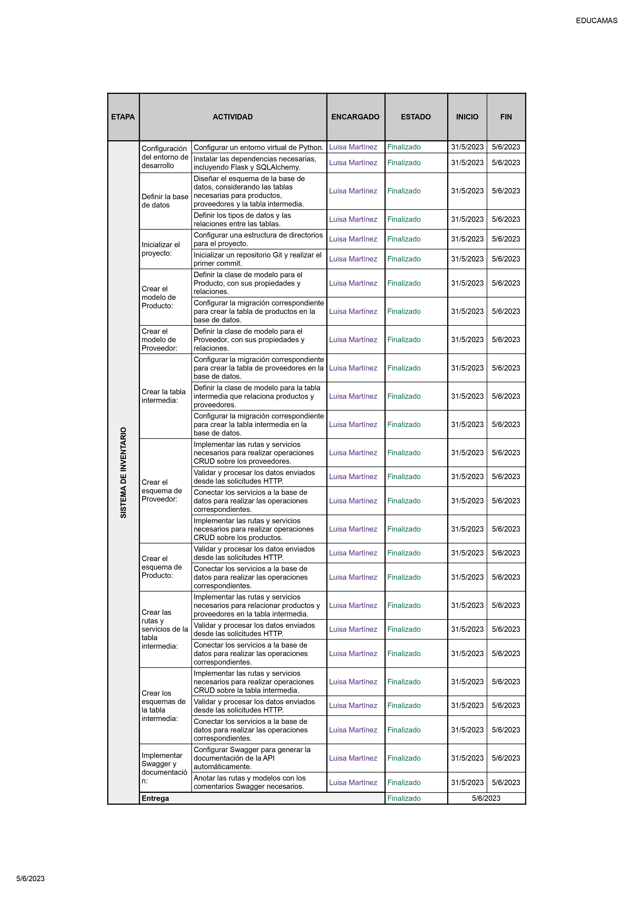

# Proyecto de CRUD de Películas - FastAPI

## Descripción

Este proyecto de Sistema de inventarior de una API RESTful desarrollada con FastAPI que permite realizar operaciones CRUD (Crear, Leer, Actualizar, Eliminar). Está diseñado con un enfoque de aprendizaje de programación backend.

Se tienen problemas de stock dentro del depósito de la compañía, por lo cual es necesario hacer el control de los elementos con el fin de avisar cuando estos estén debajo de 5 unidades, en esta primera fase del proyecto se realizará solo el inventario de los elementos y los proveedores de estos. Se anexa una idea de esquema de base de datos. 

También se hará entrega de un backlog para que sea usado en el desarrollo del proyecto.

Solo se debe realizar la API para ser posteriormente conectada al frontend, esta debe tener operaciones CRUD sobre los productos y sobre los proveedores, además se debe tener una relación entre estos.

## Contexto del proyecto

Como desarrollador Fullstack, desarrollar aplicaciones web.

## Base de datos

Base de datos para la clase

## Backlog

Backlog usados

## Tecnologías utilizadas

- Python
- FastAPI
- Pydantic
- MySQL
- Git

## Entregables

- Repositorio en GitHub que realiza operaciones:
- CRUD sobre los productos
- CRUD sobre los clientes
- CRUD de la relación entre las dos tablas.

## Uso

1. Inicia la aplicación:

uvicorn main:app --reload

2. Accede a la documentación de la API en tu navegador:

http://localhost:8000/docs

## Contacto

Si tienes alguna pregunta o sugerencia o quieres el workbook para desarrollar este proyecto, no dudes en contactarme en [luisamartinez030503@gmail.com](luisamartinez030503@gmail.com)